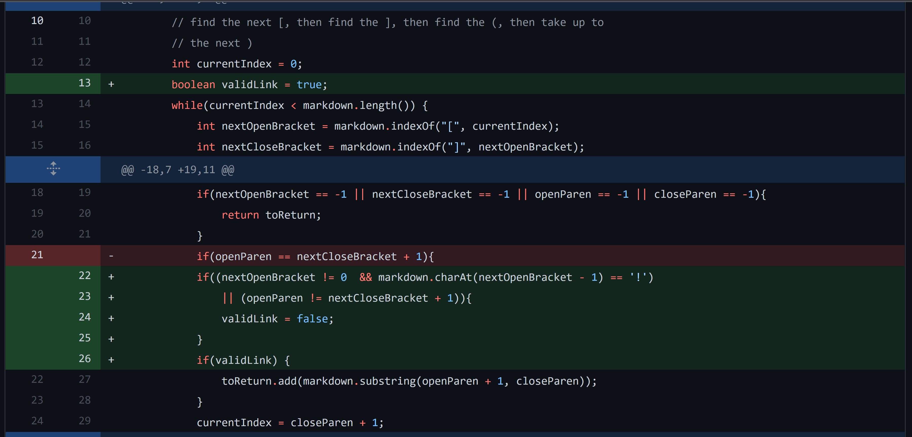

# Lab Report 2
## Commit 1

[No link test file.](https://github.com/erichu100/markdown-parse/blob/main/noLinkFile.md)

Output: `IndexOutOfBoundsException.`

The bug was not checking if open and closed brackets and parentheses were found. As such, when given an input without any parentheses or brackets, the program attempts to run substring with -1 as a parameter (on current build -2 due to image and backslash checks), throwing an IOOB exception.
## Commit 2

[Detached brackets and parenthesis test file.](https://github.com/erichu100/markdown-parse/blob/main/fakeLink.md)

Output: `["(also known as felis catus)"]`

The bug was assuming every pair of brackets followed by a pair of parentheses is a link, regardless of distance between the brackets and parentheses. When given an input with text (meow meow meow) between brackets and parentheses, it still returns the text within the parentheses as a link.
## Commit 3

[Image test file.](https://github.com/erichu100/markdown-parse/blob/main/imageTest.md)

Output: `["(https://something.com)", "(some-page.html)"]`

The bug was once again assuming every pair of brackets followed by a pair of parentheses is a link, this time not accounting for images. When given an input of two images, it would incorrectly classify the addresses of the images as links.