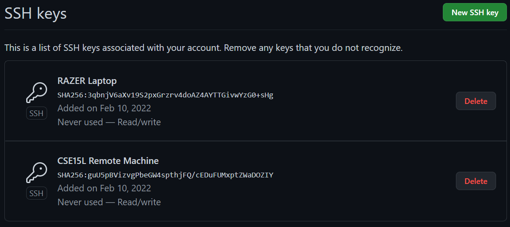
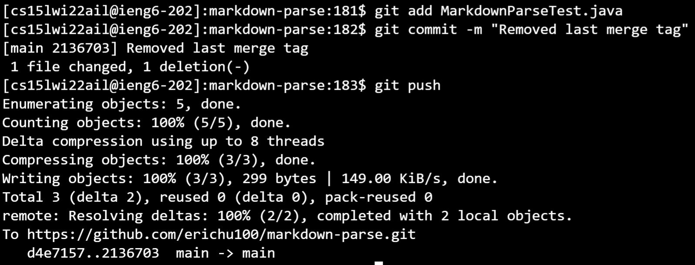

# Lab Report 3: Setup Github Access from ieng6
### Public Keys on Github:

To do certain actions from terminal, Github now requires ssh keys. Pictured is where public keys are stored and uploaded to github.

### Public + Private Key location on PC:

When pushing changes to github, the machine must have a private key matching one of the stored public keys. Private keys are missing the .pub suffix.

### Public + Private Keys on remote machine:

The machine can be either virtual or local. There are multiple encryption types for key generation as well. rsa is currently considered outdated, so the ed25519 keys are used instead.

### Successful Remote Commit + Push:

After setting up the ssh keys, commands such as git commit and git push can be used. Additional security such as a password can be added during key creation if desired.

[Commit Link.](https://github.com/erichu100/markdown-parse/commit/2136703714a308a3b51657d5bd83c3f9f846fa1e)