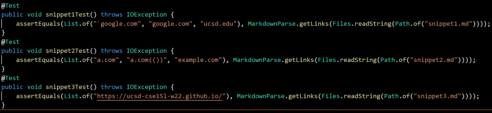
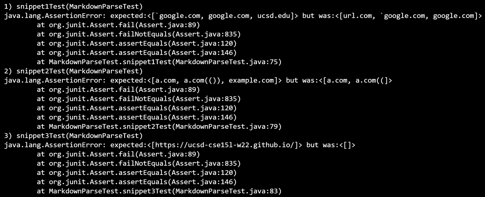
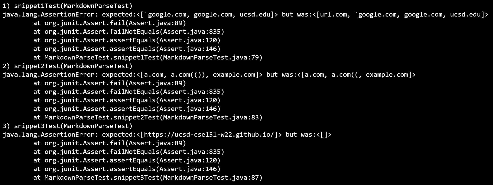

# Week 8 Lab Report
### [Personal Repository](https://github.com/erichu100/markdown-parse)
### [Peer Review Repository](https://github.com/BasilThaddeus/markdown-parse)
### Test Structure:

### Personal Implementation Test Results:

### Peer-Review Implementation Test Results:

### Personal Implementation Issues:
* First test: Ignores backticks. Reads url.com since it counts the first bracket in `[a link`](url.com) when it shouldn't. Doesn't read ucsd.edu since it counts the second bracket in [`code]`] when it shouldn't.
* Second Test: Counts the first closing parenthesis in (a.com(())) as the closing parenthesis for the link. Counts the first closing bracket in \[some escaped \\[ brackets \\]](example.com) as closing bracket for the link.
* Third Test: Any " " between the parenthesis portion of the link declares it invalid (including tabs?).
### Personal Implementation Solutions:
* Backslashes **(Snippet 2)**: Currently have code which checks for backslashes before open brackets, including cases with multiple backslashes. However, it only checks before the open bracket, and is only able to invalidate a link.
    * The best fix may be to read through all the backslashes first and store any indices with canceled modifiers to avoid having to add a backslash check to every other modifier check. Would need modification of indexOf's starting or ending indices.
* Backticks **(Snippet 1)**: Similar to backslashes, likely need to read through the file at the beginning since backticks can appear both inside and outside links. Can use backslash universal method to determine when backtick was canceled. After determining the positions of parentheses + brackets, check if any land within a code block. If true, look for the next parenthesis/bracket.
* Nested Parenthesis **(Snippet 2)**: Use the implementation from lab. Create a method to find the index of the corresponding closed parenthesis by keeping track of how many opens and closes there are.
* Line Breaks **(Snippet 3)**: Line breaks have a lot of edge cases. Two consecutive line breaks always end a link, one line break is fine anywhere in the brackets, directly after the opening parenthesis and directly before the closed parenthesis. Requires many if statements, but should be doable.