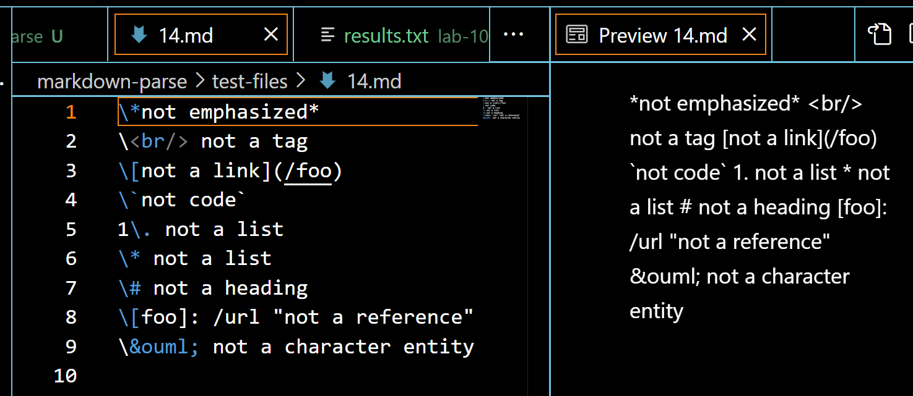
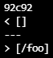
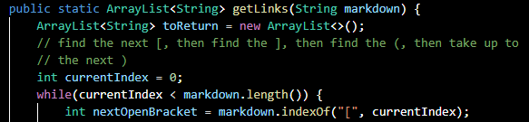
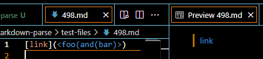
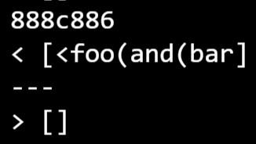
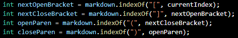

# Week 8 Lab Report
## Finding tests with different results
Put the the results of running bash files into txt files then used diff on them.
Had reclone markdown-parse and match personal print method to clone and remove any test prints to prevent false positives from differences in format.
However, matched instructor bash script to personal bash script as personal script included echo for file name.
Personal results file has two extra lines compared to instructor results, likely due to a new line being included in an output link.
## Test 14:
### Expected

Expected: No links.
### Results

Personal Implementation: No links.

Instructor Implementation: `/foo`
### Bug

Bug (Instructor Implementation): Does not account for backslashes before first bracket.

## Test 498:
### Expected

Expected: `foo(and(bar)`
### Results

Personal Implementation: `<foo(and(bar`

Instructor Implementation: No links.
### Bug

Bug (Personal Implementation): Angled brackets automatically turn anything between them into a link. In this case, when put between parenthesis for another link, the program must ignore any closing parentheses within the angled brackets.
